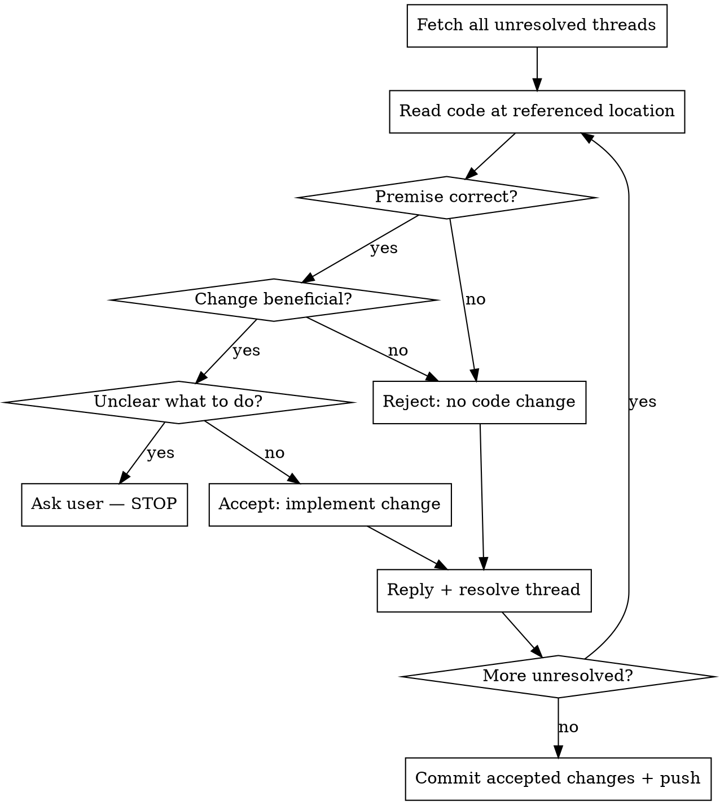

# Address PR Comments

## Overview

Critically evaluate every comment before acting. Reviewers — especially AI reviewers — sometimes misread code, reference stale state, or make preference-based suggestions dressed as correctness issues. Never implement blindly. Always reply with your reasoning and resolve the thread.

## Process



**Stop and ask the user when:**
- The suggestion involves product/business behavior, not just code quality
- Implementing requires information that isn't in the codebase
- Multiple valid approaches exist with significant trade-offs
- The suggestion conflicts with something the user previously decided

## Critical Evaluation Checklist

Before deciding, verify:

1. **Premise check** — Read the *current* code at the referenced line. Did the reviewer actually read the right version? (After a rebase, comments on the base diff may describe code that no longer exists.)
2. **Correctness** — Is the suggested change technically correct? Does it compile/work?
3. **Necessity** — Is this a correctness issue, or style/preference? Preference-only suggestions can be rejected.
4. **Side effects** — Does accepting introduce a new bug, regression, or conflict with another accepted change?
5. **Duplication** — Is this already handled elsewhere in the codebase or by another comment you already accepted?

## Decision Reference

| Decision | When | Reply content |
|---|---|---|
| **Accept** | Premise correct, change is an improvement | Explain why the reviewer is right; describe what you changed |
| **Reject** | Premise wrong, or change is harmful/unnecessary | Explain the actual code behavior; state why no change is needed |
| **Clarify** | Ambiguous intent, product decision, or conflicts | Ask the user before touching anything |

## GitHub CLI Commands

### Fetch unresolved threads with IDs (required for resolving)

```bash
REPO=$(gh repo view --json owner,name -q '.owner.login+"/"+.name')
PR=<number>

gh api graphql -f query='
query($owner: String!, $repo: String!, $pr: Int!) {
  repository(owner: $owner, name: $repo) {
    pullRequest(number: $pr) {
      reviewThreads(first: 100) {
        nodes {
          id
          isResolved
          path
          line
          comments(first: 3) {
            nodes {
              databaseId
              author { login }
              body
            }
          }
        }
      }
    }
  }
}' -f owner="${REPO%%/*}" -f repo="${REPO##*/}" -F pr=$PR
```

### Reply to a comment thread

```bash
gh api --method POST \
  "repos/$REPO/pulls/$PR/comments/$COMMENT_DATABASE_ID/replies" \
  --field body="Your reply here"
```

`$COMMENT_DATABASE_ID` is the `databaseId` integer from the GraphQL response above (the first comment in each thread).

### Resolve a thread

```bash
gh api graphql -f query='
mutation($id: ID!) {
  resolveReviewThread(input: {threadId: $id}) {
    thread { isResolved }
  }
}' -f id="$THREAD_NODE_ID"
```

`$THREAD_NODE_ID` is the `id` string (e.g. `PRRT_...`) from the GraphQL response above.

## Reply Format

Keep replies concise. Lead with the decision:

```
**Accepted** — <one sentence on why the reviewer is right and what changed>
```

```
**Not changed** — <one sentence explaining the actual behavior / why no change is needed>
```

```
**Question** — <one sentence asking the specific thing that's unclear>
```

## Commit

Batch all accepted changes into a single commit before pushing. Use a clear message:

```
fix: address PR review comments

- <bullet per accepted change>
```

## Common Mistakes

**Implementing before verifying the premise**
Reviewers often read the diff, not the final file. A rebase may have already fixed what they flagged. Read the current file first.

**Resolving without replying**
Resolving silently looks dismissive. Always reply, even for rejections — it closes the loop for the reviewer.

**Rejecting without explanation**
"Not changed" with no reason invites re-review of the same comment. Explain clearly why the current code is correct.

**One commit per comment**
Noisy history. Batch all accepted changes.

**Asking the user for every ambiguous detail**
Only stop for genuine blockers. Style questions and minor ambiguities should default to the most conservative/consistent choice with the rest of the codebase.